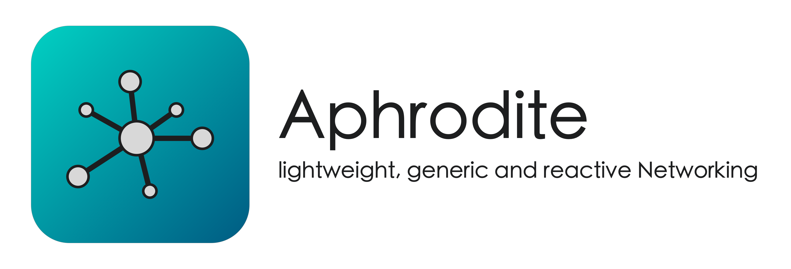

<p align="center">
    
</p>

<p align="center">
    <a href="https://github.com/LinkAndreas/Aphrodite/releases">
        
    </a>
    
    
    <a href="https://github.com/LinkAndreas/Aphrodite/blob/stable/LICENSE.md">
        
    </a>
</p>

<p align="center">
    <a href="#installation">Installation</a>
  • <a href="#motivation">Motivation</a>
  • <a href="#structure">Structure</a>
  • <a href="#example-apps">Example Apps</a>
  • <a href="#improvements">Improvements</a>
  • <a href="#credits">Credits</a>
  • <a href="#license">License</a>
  • <a href="https://github.com/LinkAndreas/Aphrodite/issues">Issues</a>
</p>

# Aphrodite

Aphrodite is a lightweight, generic and reactive network layer that is built on top of `Combine` and `NSURLSession`. Usage avoids repetitive code and enables advanced features like entity- and domain model separation when communicating with REST APIs.

## Features

- Structures endpoints in a consistent way
- Facilitates entity- and domain model separation
- Integrates automatic JSON De-/Encoding 
- Supports network plugins with target scopes
- Offers a rich set of plain-, data-, model- and mappedModel- requests
- Easily integrates with your iOS, macOS, or tvOS apps

## Installation

Installation via [SwiftPM](https://swift.org/package-manager/) is supported.

## Motivation

Managing network requests in an app is complex and quickly results into cluttered code that is highly repetitive. In addition, data that is provided by the network layer, i.e., entities, often require additional processing before they are suitable for the application's domain. When no distinction is made, developers tend to rely on in-line data conversions that clutter the code and make it less readable. _Aphrodite_ mitigates these issues by providing a rich set of generic requests that encapsulate the repetitive behavior and allow a clear distinction between the data representation that is sent over the network, i.e., entities, as well as the representation that is used in the application's domain, i.e., domain models. _Aphrodite_ is inspired by _Moya_ ([Link](https://github.com/Moya/Moya)) and uses Apple's own URL Loading System (`NSURLRequest`) as well as `Combine`.   

## Structure

_Aphrodite_ consists of the following components:

### Aphrodite Client

The `AphroditeClient` acts as the main interface to the library. All network calls are made using the client. During instantiation, the domain error factory as well as target-specific network plugins are defined. The later are executed for each request matching the plugin's predefined target-scope. 

```swift
let client: AphroditeClient<DomainErrorFactory> = .init(plugins: [])
```

### AphroditeDomainErrorFactory (Protocol)

When instantiating an `AphroditeClient` a dedicated domain error factory is required. The factory is used to map errors of type `AphroditeError` to context- and domain-specific errors. Applications specify their own factory by conforming to the `AphroditeDomainErrorFactory` protocol:

```swift
enum DomainErrorFactory: AphroditeDomainErrorFactory {
    static func make(from error: AphroditeError) -> DomainError {
        ...
    }
}
```

The following errors are supported by Aphrodite:

```swift
public enum AphroditeError: Error {
    case unauthorized(HTTPURLResponse, Data)
    case forbidden(HTTPURLResponse, Data)
    case notFound(HTTPURLResponse, Data)
    case client(HTTPURLResponse, Data, StatusCode)
    case server(HTTPURLResponse, Data, StatusCode)
    case decoding(HTTPURLResponse, Data, DecodingError)
    case encoding(EncodingError)
    case underlying(HTTPURLResponse, Data, Error)
    case serviceCancelled
    case notConnectedToInternet
    case unexpected
}
```

By defining a domain-specific factory, apps decide whether they need more fine-grained control, or whether errors are treated in a similar way. For instance, an app may decide to treat an `underlying` error similarly to an `unexpected` error. You can find an example for a domain-specific factory in the Example App in the [section](###Example-Apps) below.

### Network Target
_Aphrodite_ organizes endpoints in targets, similar to _Moya_ ([Link](https://github.com/Moya/Moya)). Network targets are defined by conforming to the `NetworkTarget` protocol:

```swift
public protocol NetworkTarget {
    var baseUrl: String { get }
    var scope: [NetworkPluginTargetScope] { get }
    var requestTimeoutInterval: TimeInterval { get }
    var path: String { get }
    var method: HttpMethod { get }
    var requestType: HttpRequestType { get }
    var headers: [HttpHeaderField: String] { get }
}
```

While the combination of `path` and `baseUrl` forms the URL of the endpoint, the `scope` defines the set of network plugins that are applied to the target. In contrast, `requestTimeoutInterval` defines the maximum duration, the client should wait for a response. In addition, by specifying the `requestType` the application can decide whether custom data needs to be attached to the request. This way, the application can decide whether the data should be attached as parameter or as encoded data within the requests body. Finally, the `method` corresponds to the Http method that is used with the request, i.e., whether `GET`, `POST`, `PUT` ... is applied. 

Subsequently, an example target named `UserManagement` is given:

```swift
enum UserManagement: NetworkTarget {
    case fetchUser(userId: Int)
    case fetchAvatarImageData(userId: Int)
    case acceptAgreement

    var baseUrl: String {
        return "https://custom-domain.com/users"
    }

    var requestTimeoutInterval: TimeInterval {
        return 10
    }

    var path: String {
        switch self {
        case let .fetchUser(userId):
            return ""

        case let .fetchAvatarImageData(userId):
            return "\(userId)/avatar"

        case .acceptAgreement:
            return "accept"
        }
    }

    var method: HttpMethod {
        switch self {
        case .fetchUser, .fetchAvatarImageData, .acceptAgreement:
            return .get
        }
    }

    var requestType: HttpRequestType {
        switch self {
        case .fetchUser, .fetchAvatarImageData, .acceptAgreement:
            return .plainRequest
        }
    }
}
```

### Generic Network Requests

Since network communication is flaky, dedicated error handling is required. In addition, response data needs to be decoded before it can be used within the application domain. _Aphrodite_ simplifies these tasks by offering a rich set of requests featuring unified error handling as well as automatic data de-/encoding. Note that the following examples are based on the `UserManagement` target as mentioned above.

#### Plain Request

First, **Plain Requests** are the simplest type of request. They do not expect data in the response and hence only act as "trigger" to communicate events over the network. For instance, plain requests are well suited to signal a user's acceptance to an agreement to a remote server. Since requests in _Aphrodite_ are based on `Combine`, you can subscribe to the publisher to get notified when the request succeeded or failed.

```swift
client
    .request(UserManagement.acceptAgreement)
    .sink(
        receiveCompletion: { completion in
            switch completion {
            case let .failure(error):
                // Network call failed

            case .finished:
                // Network call finished
            }
        },
        receiveValue: {
            // Network call succeeded
        }
    )
    .store(in: &cancellables)
```

#### Data Request
Second, **Data Requests** are appropriate when access to the raw data of the response is required. As an example, the image data for the user associated with user ID `42` is retrieved using the following request:

```swift
client
    .requestData(UserManagement.fetchAvatarImageData(userId: 42))
    .sink(
        receiveCompletion: { completion in
            switch completion {
            case let .failure(error):
                // Network call failed

            case .finished:
                // Network call finished
            }
        },
        receiveValue: { data in
            // Network call succeeded
        }
    )
    .store(in: &cancellables)
```

#### Model Request
Rather then passing the raw data to the domain, **Model Requests** try to decode the underlying data into the type specified by the `receiveValue` closure in the application's domain. _Aphrodite_ handles the decoding automatically and throws a decoding error if the decoding failed. For instance, consider the following data structure:   

```swift
struct User {
    let id: Int
    let name: String
}
```

If the response data matches the string representation of a `User` encoded in JSON, the framework will automatically instantiate a `User` and provide it to the domain via the `receiveValue` closure:

```swift
client
    .requestModel(UserManagement.fetchUser(userId: 42))
    .sink(
        receiveCompletion: { completion in
            switch completion {
            case let .failure(error):
                // Network call failed

            case .finished:
                // Network call finished
            }
        },
        receiveValue: { (user: User) in
            // Network call succeeded
        }
    )
    .store(in: &cancellables)
```

#### Mapped-Model Request

Finally, **Mapped-Model Requests** facilitate entity- and domain-model separation. To illustrate this distinction, please consider the following example: 

```swift
struct BuildingEntity {
    let name: String
    let latitude: Float
    let longitutde: Float
}

struct Building {
    let name: String
    let location: CLLocationCoordinate2D
}
```

While `BuildingEntity` represents the data structure that is received from the network, `Building` represents the model that is used within the application domain. Notice that `Building` defines it's location as `CLLocationCoordinate2D`. The later is offered by the `CoreLocation` framework and is frequently used to represent coordinates within the two-dimensional space. The mapping between both types is established through the `BuildingModelMapper` who's single responsibility is to match a given entity into the corresponding domain representation. Note that this approach also works the other way around, i.e., when sending domain data to a remote sever.

```swift
enum BuildingModelMapper {
    static func makeModel(from entity: BuildingEntity) -> Building {
        return .init(
            name: entity.name,
            location: .init(
                latitude: entity.latitude, 
                longitude: entity.longitude
            )
        )
    }
}
```

_Aphrodite_ handles the mapping internally and only requires the mapping function as argument. The resulting **Mapped-Model Request** is stated below:

```swift
client
    .requestMappedModel(RealEstateManagement.building(name: "Empire State Building"), mapper: BuildingModelMapper.map)
    .sink(
        receiveCompletion: { completion in
            switch completion {
            case let .failure(error):
                // Network call failed

            case .finished:
                // Network call finished
            }
        },
        receiveValue: { (building: Building) in
            // Network call succeeded
        }
    )
    .store(in: &cancellables)
```

### Sending Data over the network

In addition to data retrieval, _Aphrodite_ supports multiple ways to attach data to network requests. While data can be sent as raw data without modification, it can also be attached as request parameters. The later requires a dedicated parameter encoding that is used to encode data before it is sent over the network. Inspired by _Moya_ ([Link](https://github.com/Moya/Moya)), _Aphrodite_ offers the `URLParameterEncoding` as well as the `JSONParameterEncoding`. In addition, applications can specify their own encoding by conforming to the `ParameterEncoding` protocol:

```swift
public protocol ParameterEncoding {
    func encode(_ urlRequest: URLRequest, with parameters: [String: Any]?) throws -> URLRequest
}
```

Finally, to facilitate the clear distinction between entity- and domain models, data can also be attached as entity- or domain-model directly. The later requires a mapper function that transforms a given entity into the corresponding domain model. Subsequently, examples for the different data attachment options are stated:

```swift
struct PrivacyAgreementParameterEntity: Codable {
    let timestamp: Date
    let isNewsletterAllowed: Bool
    let isTrackingAllowed: Bool 
}
```

```swift
enum UserManagement: NetworkTarget {
    case acceptAgreement 
    case uploadImage(Data)
    case updatePrivacyAgreement(PrivacyAgreementEntity)
    case createProfile(profileName: String)
    case register(UserInfo)
    ...

    var task: HttpTask {
        switch self {
            // Plain Request
            case .acceptAgreement:
                return .plainRequest

            // Data Request
            case let .uploadImage(data):
                return .uploadImage(data)

            // Parameter Request
            case let .createProfile(profileName):
                return .requestWithParameters(
                    parameters: ["profileName": "\(profileName)"],
                    encoding: JSONParameterEncoding()
                 )

            // Data Request made from given entity
            case let .updatePrivacyAgreement(entity):
                return .requestWithData(from: entity)

            // Data Request made from given model and mapper
            case let .register(userInfo):
                return .requestWithData(from: userInfo, mapper: UserInfoModelMapper.map)
            ...
        }
    }
}
```

### Network Plugins

Network Plugins provide the opportunity to modify requests before they are being sent over the network. In addition, applications can get notified whenever a response is received. This is useful when including additional information, e.g. bearer tokens in the request's headers or when extracting information from a response that is received. While _Aphrodite_ also comes with built-in plugins like the `NetworkLoggerPlugin`, custom plugins are created by conforming to the `NetworkPlugin` protocol. 

```swift
public protocol NetworkPlugin {
    var targetScope: NetworkPluginTargetScope { get }

    func prepare(_ request: URLRequest, target: NetworkTarget) -> AnyPublisher<URLRequest, Never>
    func willSend(_ request: URLRequest, target: NetworkTarget)
    func didReceive(_ result: Result<NetworkResponse, AphroditeError>, target: NetworkTarget)
}
```

All methods are optional, i.e., plugins that are only used for information extraction do not have to deal with request preparation. Still, plugins may also take care of both. The `NetworkPluginTargetScope` specifies the set of targets, plugins are applied to. This is especially useful when dealing with multiple backends, i.e., one could define a target scope for each backend and use separate authentication plugins respectively. Plugins that apply to all targets feature an `.universal` target scope. Note that the list of `NetworkPlugins` used by the `Aphrodite` are specified during the client's initialization.

### Example Apps

// TODO: Refer to an example app that uses Aphrodite as Networking Library.

## Improvements

The following issues/enhancements can be addressed in future revisions:

- [ ] Write Example App section
- [ ] Include unit tests to guarantee test coverage
- [ ] Extend documentation

## Credits

The design of this library was inspired by _Moya_ ([Link](https://github.com/Moya/Moya)).

## License

This library is released under the [MIT License](http://opensource.org/licenses/MIT). See LICENSE for details.
